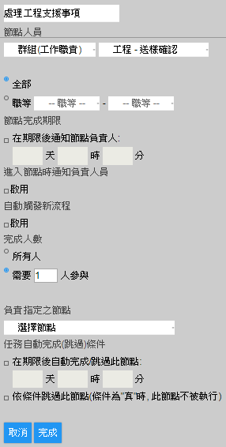

# 概念

OmniBPM (Omni Business Process Management) 是以「文件」和「流程」為中心的企業管理軟體。文件的設定可以依照企業管理的需求彈性的增加欄位，而流程則可以配合企業作業的需求設定參與的使用者及各使用者負責完成文件的順序。這是非常有彈性的，只要掌握了基本概念，就可以設計出各種符合自己需要的流程。

要了解本系統，建議企業的系統管理者可以依照本文件的順序來閱讀，而一般的使用者可以直接跳到[發起第一個流程](#FirstFlow)。

在這個文件當中，不同的訊息使用下面不同的格式來表示。

> **Note**
> 
> 代表補充的訊息。

> **Important**
> 
> 代表重要的訊息，使用時不注意時可能會與預期的結果不同。

> **Tip**
> 
> 代表使用的提示。

## 文件 (document)

舉個簡單的例子，小學時候的聯絡簿：

在 OmniBPM 系統裡，這就是一個文件（document）。

## 模板 (template)

而空白的聯絡簿，我們稱為模板（template），一個模板可以生出很多同類型的文件，例如：

## 使用者 (user)、任務 (task) 與流程 (process flow)

一份文件往往是由不同**使用者**來合作完成的。例如聯絡簿，就是由老師、學生和家長三個人共同完成。要完成聯絡簿，必須有三個**任務**：

1.  先由學生填寫日期和本日作業欄位。

2.  完成後交給家長檢查並簽名。

3.  最後交給老師檢查並簽名。

每個任務指定了該由誰填哪個欄位，以及任務與任務之間的先後順序。所有的任務，構成了一個**流程**。

以上是最基本的概念。OmniBPM 其他強大的功能皆由此衍生而出，例如指定使用者時可用部門層級來區分、任務不見得只能按照線性的順序，可以有分支等等。這些會在之後的章節慢慢介紹。

# 開始使用 OmniBPM

這是 OmniBPM 的登入畫面，輸入帳號密碼即可登入。

> **Tip**
> 
> 帳號的格式是「"使用者帳號名"@"公司代碼"」

登入後可以見到如下主畫面。

# 系統基礎設定

為了能夠使OmniBPM系統正確的傳送文件以及發送電子郵件通知，在企業開始始用系統之前，有一些基本的設定需要完成。 請點選上方選單「設定」→「公司基本資料設定」→「公司組織設定」，進入管理畫面。

## 部門與職等在系統中的作用

部門和職等的設定的主要用途是用於判斷每個使用者的直屬主管。當部門主管未設定的時候，系統會自動認定該部門中職等最高的人員做為部門主管。 部門也可以另外設置部門主管，部門主管的設定不限制主管一定需要屬於該部門。

> **Tip**
> 
> 當一個人分管多個部門的時候可以設定他為多個部門的主管。

文件簽核的時候，一個使用者的直屬主管會是他所屬部門的部門主管。 當一個使用者已經是他所屬部門最高職等人員時，他的直屬主管會是該部門母部門的部門主管。

部門主管在系統中的作用主要有： . 當流程設定需要主管簽核時，系統會以上面所述的規則來判斷應該送給哪一位主管來簽核。 . 系統每日會發送每個人待辦事項的清單給該員的直屬主管。 . 權限設定的時候也可以以部門為單位授予權限。 . 流程設計中，可以以部門人員為任務的負責單位。

> **Important**
> 
> 在權限設定以及流程設計中使用部門時，這時候包含的人員只有直接屬於該部門的人，子部門或是母部門的人員不在包含的人員之中。

**部門設定.**

企業可以依照企業的組織來設定部門，每個使用者都屬於某一個部門，點選左方選單的「部門」後，按「新增子部門」按鈕建立部門。每個使用者都屬於某一個部門，點選左方選單的「部門」後，按「新增子部門」按鈕建立部門。 部門可以是樹狀的結構，如果需要增加子部門，則在母部門後按「新增子部門」按鈕建立部門。如果需要增加子部門，則在母部門後按「新增子部門」按鈕建立部門。 

如果需要更改部門的樹狀結構，請直接用滑鼠拖曳部門名稱後再移動到希望該部門所在的區域。

部門主管的設定也請直接點選該部門主管名稱後指定。

**職等設定.**

點選左方選單「職等」後，輸入職等名稱並按「新增」按鈕新增。 職等的清單中，越在上面的表示越高的職等，董事長應該是在最高的位置。 當希望更改職等的順序時，可以用滑鼠拖曳職等。 

## 使用者設定

**新增使用者.**

要幫公司的每個員工建立一個使用者帳號，點選左方選單「使用者」後，輸入帳號資料並按「新增使用者」按鈕建立使用者。 每日發送的待辦事項將會發送到所設定的電子郵件。

> **Important**
> 
> 使用者登入時需要以「帳號@公司碼」來登入，但是新增使用者時不需要輸入公司碼。

**變更現有使用者.**

直接在左方列表點選使用者，可直接編輯使用者。 在編輯使用者的同時，也可以設定該使用者的

1.  職務代理人
    
    職務代理人也可以由使用者自行設定，請參考[職務代理人](#Substitute) 章節。

2.  權限
    
    權限的設定相當於系統中「設定」→「公司基本資料設定」→「修改權限」。有關權限的定義還有設定，請參考[權限設定](#CtrlPermissions)章節。

3.  群組(工作職責)
    
    群組(工作職責)的設定將在下的章節中介紹。

## 群組(工作職責)

群組是比部門更彈性的使用者分類方式，一個員工可以同時屬於多個群組，不同部門的員工加入同一個群組內。

> **Tip**
> 
> 在設計流程的時候，相似的工作一般會設定成由同一個群組的人員來完成。 這樣企業內人員異動時可以直接透過設定群組人員名單來達成工作的移交。另外某一個工作過於繁重需要更多人員處理時，也可以透過增加該群組內負責人員的數量來達成。

**新增群組.**

請在輸入好群組名稱後按「新增」建立群組。

> **Tip**
> 
> 在初期設定時，不需要立刻建立好所有群組，群組可以在設計流程時依照流程的需求再新增。

**群組人員設定.**

這個畫面有一個下拉式選單，其代表「不在群組裡的使用者」，然而下方方框中則是「群組內的使用者」。要將使用者加入或移出群組，就是按「＋」或「╳」。 使用方法是點左側「群組」選單，輸入群組名稱後，再從左側的使用者清單內選擇要加入的使用者。按「＋」按鈕將選擇的使用者加入群組，或是右側的清單內選擇欲移除的使用者，再按「╳」按鈕。 選好使用者後，將會自動儲存群組人員的變更。

**編輯群組.**

若要編輯群組，滑鼠單點畫面左邊已有的群組，選擇後即可編輯。

## 刪除現有使用者

**刪除.**

當一個人員離職時，需要刪除該員的帳號，帳號的刪除可以防止企業資訊的外流，所以是非常重要的。要刪除目前的使用者，只需要點選該使用者後再按「刪除使用者」。 另外 OmniBPM 系統收費的方式是以當月中企業最多使用者時的使用者人數來計算，所以即時的刪除離職人員帳號也有助於減少系統使用的費用。

一個使用者被刪除只代表該員無法再登入系統，但是並不會造成系統中任何的文件被刪除。使用者被刪除時建議要同時做以下設定:

1.  代理人
    
    設定代理人後，該員目前負責處理的事項以及原本未來該員應處理的事項，應由代理人來處理。

2.  電子郵件
    
    被刪除人員的待辦事項仍然會每天以電子郵件發送，所以應該將他的電子郵件設定到主要代理人的電子郵件上。

3.  群組（工作職責）
    
    如果某一個群組中只有該員是成員，應該要加入新的成員，這個成員可以是他的代理人或是新召募的員工。 否則當流程進行到需要這個群組的人員負責處理任務時，會沒有人員處理該任務。

**恢覆帳號.**

帳號誤刪除時，或是人員覆職時，可以點選該帳號後再按「恢復使用者」來回覆該員的帳號。

> **Tip**
> 
> 記得要重新檢查代理人的電子郵件、權限、群組等等的設定是否需要調整。

# 權限管理

權限管理可以由「設定」→「公司基本資料設定」→「修改權限」來進行。

| 權限            | 管制的功能                                            | 說明                                                 |
| ------------- | ------------------------------------------------ | -------------------------------------------------- |
| 權限管理          | 「設定」→「公司基本資料設定」→「修改權限」                           |                                                    |
| 職等管理          | 「設定」→「公司基本資料設定」→「修改權限」→「職等」                      |                                                    |
| 部門管理          | 「設定」→「公司基本資料設定」→「修改權限」→「部門」                      |                                                    |
| 使用者管理         | 「設定」→「公司基本資料設定」→「修改權限」→「使用者」                     |                                                    |
| 群組管理          | 「設定」→「公司基本資料設定」→「修改權限」→「群組」                      |                                                    |
| 流程管理          | 「設定」→「表單與流程設定」→「流程編輯器」、「設定流程選單分類」、「新增/編輯下拉式欄位選項」 |                                                    |
| 文件管理          | 「設定」→「表單與流程設定」→「流程權限管理」                          |                                                    |
| 流程除錯管理        | 「設定」→「表單與流程設定」→「流程除錯」                            |                                                    |
| 標籤權限          | 「設定」→「標籤管理」                                      | 一般使用者只能管理自已的標籤，有些權限的人可以管理全域標簽。關於標籤請參考[標籤](#Tag)章節。 |
| 報表管理          | 「設定」→「報表設定」→「報表權限管理」                             |                                                    |
| Dashboard.all | 「流程儀表板」                                          | 一般使用者只能看到和自已相關的數據，有此權限的人可以看到全公司的數據。                |

權限的定義

# 建立模板(建立新流程)

我們拿「請假流程」來當範例，點選上方選單「設定」→「表單與流程設定」→「流程編輯器」建立新的流程。

編輯流程有六個步驟：

1.  流程名稱

2.  文件欄位

3.  流程

4.  任務指定

5.  預覽

6.  完成（權限設定）

## 流程名稱

輸入流程的名稱，此處我們輸入「請假單」。

## 文件欄位

一個流程被創建了以後，第一步是先定義該流程配合的文件需要哪些欄位。

**欄位型態.**

每個欄位都應該有適合該欄位的型態。系統支援的欄位型態有整數、實數(整數&小數)、文字、日期、日期時間、核取框(CHECKBOX)、是非、下拉式選單、連結位址、空格、創建者姓名、創建者帳號、創建者部門、創建者職等、表格或是公式函數等。 OmniBPM 也可以在一個文件中新增表格，表格的每一欄的型態也可以依照實際使用的需求來選擇。 要新增一個欄位請依照所需要的型態按「＋整數」等等的按鈕。

> **Tip**
> 
> 模板中一些裝飾性的文字和排版時輔助用的空白，可以用「＋空格」來實現。

**欄位設定.**

在按了欄位型態的按鈕之後，該型態的欄位就新增到這個樣板之中了，這時候必須對於這個欄位的名稱做設定。設定時的介面如下:

除了欄位名稱以外:

1.  放大/縮小
    
    增/減加此欄位的寬度

2.  數據表格
    
    關於數據表格的設定，請參考[聯結外部資料庫](#ExternalDatabase)章節。

**請假單.**

在這個範例裡，我們依序新增六個欄位：

1.  請假人
    
    首先點選「＋文字」按鈕，畫面會新增一個欄位，在左側欄位名稱輸入「請假人」後，按「完成」。
    
    

2.  開始時間
    
    同理，點選「＋日期時間」，新增一個「開始時間」欄位。

3.  請假時數（＋整數）

4.  假別
    
    點選「＋下拉式選單」，欄位名稱輸入「假別」，右邊選單選擇「新增下拉式選單」，輸入「放假種類」後按「新增」。
    
    
    
    新增完之後，請確認右上角的下拉選單已經選為「放假種類」，即可按「完成」。
    
    
    
    > **Important**
    > 
    > 此處只是將下拉選單的列表取個名字而已，真正的內容選項（以此範例來說，是「病假」、「事假」、「喪假」、「產假」、「育嬰假」），之後將會在上方選單「流程管理」→「新增/編輯下拉式欄位選項」中設定。

5.  主管同意（＋文字）

6.  人資核對（＋文字）

下圖是完成後的樣子，請按「下一步」進入「流程」。

## 流程

**概念.**

OmniBPM 系統對於流程設計有非常大的彈性及便利性，流程的進行是由一個一個的任務組成，每一個任務可以由一個特定的人、部門、群組、或是主管來負責完成。 任務與任務是可以「同時」進行，也可以是依照先後順序來進行。實際執行任務的人員可以在流程進行中從負責的群組中來指定，也可以不指定由群組中任意的人來完成。

另外 OmniBPM 系統在設計流程時只需要針對順利完成整個流程需要執行任務的順序做設定，例外或是錯誤的狀況完全不需要在流程設計時考慮。 當流程實際進行時有例外或是錯誤需要修正，可以透過「退回」的方式來進行。「退回」的接收人是在流程實際執行時可以選擇的，因此流程設計時不需要考慮例外處理。 這樣設計讓使用者可以在更短的時間內完成流程的設定，也在流程實際執行的時候保留了最大的彈性。關於「退回」的使用，請參考[退回文件](#Reject)章節。

> **Important**
> 
> 由於「退回」不需要在流程中設定，所以一個流程中不可能出現「無限迴圈」（也就是某些任務管制點，經過一些連線最後連回自已）。系統會自動檢查是否有「無限迴圈」存在，如果出現「無限迴圈」會回報錯誤。

| 節點         | 說明                                                                                             |
| ---------- | ---------------------------------------------------------------------------------------------- |
| \[流程發起人\]  | 發起該流程的使用者。                                                                                     |
| \[待指定負責人\] | 在流程進行的過程中由流程中其他人員指定該任務負責人。                                                                     |
| 使用者        | 某一位特定的使用者。                                                                                     |
| 群組         | 某一個群組的人員：在流程進行中，如果群組節點沒有被指定負責人，那麼所有在該群組的人都會收到這份文件。但是當任何一個人處理文件完成後，該文件將會從群組所有人的待辦清單中移出到下一步的負責人。 |
| 部門         | 某一個部門的人員：在流程進行中，如果群組節點沒有被指定負責人，那麼所有在該群組的人都會收到這份文件。但是當任何一個人處理文件完成後，該文件將會從群組所有人的待辦清單中移出到下一步的負責人。 |
| 主管簽核       | 在流程中參考某一節點簽核的人員，以該員為基準上呈該員的主管。                                                                 |

任務節點種類

**流程運行的原理.**

流程進行時，一般會新增\[流程發起人\]節點做為開始點，在流程進行時當一個「任務節點」滿足了

  - 表格填寫的要求

  - 指派任務的要求

  - 簽名人數的要求

以後那麼一個任務節點就算是被完成，當一個任務節點 **連向它的所有任務節點** 都已經 **完成** 了以後，該任務節點的成員便會收到通知，需要處理該節點的任務。 由於這個觀念是流程設計的核心觀念，我們在這邊重覆一次流程運行的的規則。

> **Important**
> 
> 當一個任務節點 **連向它的所有任務節點** 都已經 **完成** 了以後，該任務節點的成員便會收到通知，需要處理該節點的任務。

**請假流程.**

現在我們來設定請假流程。這個步驟定義了這份文件的任務（由誰來簽核）以及相依先後順序關係。 請假流程如下:

1.  任意使用者發起請假，「同時」指定請假期間的代理人，

2.  發起人的上級簽核，「同時」請假期間的代理人簽核，

3.  主管同意後（不待代理人簽核）交由人資建檔「同時」發起人接收主管回覆的結果。

新增流程中的一個節點，請按「＋」並選擇節點的種類。

請假流程的節點可以如下依序建立。

1.  任意使用者發起請假
    
    新增「流程發起人」節點，任務是"填寫請假單"。
    
    

2.  「同時」指定請假期間的代理人
    
    新增「待指定負責人」節點，任務是「確認代理」，並且由「流程發起人(填寫請假單)」來指定負責人。
    
    

3.  發起人的上級簽核，「同時」請假期間的代理人簽核
    
    新增「主管簽核」節點，任務是"主管簽核"，主管參考「流程發起人(填寫請假單)」。 流程圖新增連線：由「流程發起人（填寫請假單）」→「主管簽核（主管簽核）」，由「流程發起人（填寫請假單）」→「待指定負責人（確認代理）」。
    
    

4.  交由人資建檔「同時」發起人接收主管回覆的結果。
    
    新增「群組」節點，選新增群組新增一個人事群組，任務是"人事登記"。 流程圖新增連線：由「主管簽核（主管簽核）」→「人事 群組（人事登記）」。
    
    
    
    新增「流程發起人」節點，任務是"接收主管簽核結果"。 流程圖新增連線：由「主管簽核（主管簽核）」→「流程發起人（接收主管簽核結果）」。
    
    
    
    

## 任務指定

這個步驟指定了每個任務可以編輯的文件欄位。預設是必填不能留空，否則將無法「完成」此任務，不過也可以設定為非必需。一個文件欄位可以被多個任務指定，代表這些任務都可以編輯這個欄位，文件顯示該欄位的值會以時間上最晚編輯的為主。但 OmniBPM 仍會記錄每個完成的任務所填寫的值以供備查。

> **Important**
> 
> 如果文件欄位沒有被任何任務指定可編輯的話，這個欄位的值就註定無法更動 —— 因為沒有任何使用者可以編輯它，所以要避免這種狀況。

以請假單的例子來說，一共有五個任務：

1.  填寫請假單
    
    必須填寫「請假人」、「開始時間」、「請假時數」、「假別」等四個欄位。

2.  確認代理
    
    無。使用者在這個任務只要按「簽名」就好。

3.  主管簽核
    
    必須填寫「主管同意」欄位。

4.  人事登記
    
    必須填寫「人資核對」欄位。

5.  接收主管簽核結果
    
    無。

操作方法是依序點選畫面上方的任務使其變深色（表示正在設定該任務可填的欄位，預設是必填），再點選畫面下方，該任務可修改的文件欄位使其呈現深色。如果這個欄位不是必填，可勾選「非必需」。

## 流程權限

流程權限在流程設計完成時可以設定，另外也可以從「設定」→「表單與流程設定」→「流程權限管理」設定。 流程的權限分為:

1.  可創建
    
    擁有可創建權限的人可以發起這一個流程。例如：請假流程可創建的人應該是全企業的人員；工程變更流程可以創建的人是工程人員。

2.  可讀
    
    每一個流程發起以後，只有 **流程的發起人** 和 **流程執行過程中簽核過的人員** 可以看的到這個流程的文件。而所謂的「可讀」，擁有此權限的人可以讀取這類型流程所有的文件。 例如請假單，雖然所有的人都可以發起請假的流程，但是不是每一個人都看的到所有人請假的記錄，只能看到自已填寫過的請假單。人事單位如果有超過一個人處理請假流程時，每一個人只處理部份的請假單，所以沒有一個人可以看到所有請假的記錄。如果人事主管需要看所有請假記錄，可以給予主管「可讀」的權限。「可讀」權限除了導出報表時可以導出所有該類型文件外，也包含了搜尋時可以搜尋到所有該類型的文件。 關於報表的設計與導出，請參考[報表](#Report)章節。

> **Important**
> 
> 當流程創建完成後，必須要設定好「可創建」的權限，擁有「可創建」權限的使用者才能在登入時在選單中看到該流程。若沒有設定則沒有人可以使用這個流程。

## 進階流程設定

在前面的請假流程之中，企業的系統管理者可以用最短的時間為企業完全定制化的流程。在這裡我們介紹一些進階的設定功能，可以使流程的設計還有執行能夠滿足企業運作複雜的需求。

**多人簽核任務節點.**

對於「群組」和「部門」任務節點，可以設定該任務節點需要簽核的人數，當超過設定人數簽核該任務節點後，該任務才被滿足。

按下任務節點下的編輯，設定「完成人數」，「完成人數」預設值是 **1** ，也就是只要一人簽核就滿足此任務，也可以設定為需要所有人簽核才滿足此任務。

> **Important**
> 
> 當完成人數超過一人時，第一個簽核的人員需要完成該節點 **填寫表單**、**指派人員** 的要求。後續的人仍然能更改填寫的欄位，以最後一個人簽核完成時欄位填寫的狀況為最終值下傳。

**指派任務節點的負責人.**

當某任務需要由主管指派實際的負責人（以下用「需被指派之節點」），可以按下任務節點下的「編輯」，設定「負責指定之節點」。在流程執行時，到了「負責指定的任務節點」，「負責指定的任務節點」的負責人必須把「需被指派之節點」的工作指派完成。流程運作時任務指派的操作請參考[任務指派](#JobAssignment)章節。

**同步任務節點的處理人.**

當某一個工作需要同一個人在不同的階段多次確認時，可以使用同步任務節點的處理人的功能。在較後執行到的任務節點按下任務節點下的編輯，勾選「成員與指定節點同步」並設定「任務節點」為「較先執行到的任務節點」。 當流程執行到「較後執行到的任務節點」時，系統將會參考「較先執行到的任務節點」的「任務指派」，並且以此「任務指派」做為「較後執行到的任務節點」的「任務指派」。假如「較先執行到的任務節點」沒有指定「任務指派」，那麼將以「較先執行到的任務節點」的實際簽核人員做為「較後執行到的任務節點」的「任務指派」。

> **Important**
> 
> 同步任務節點時，兩個節點的類型和限制必須完全相同。比如說，兩個節點必須都是同一個群組，且對職等沒有限制。如果沒有相同型態的節點出現在現有的流和之中，那「成員與指定節點同步」的選項不會出現。

**觸發流程.**

我們以「客戶報價單」觸發「請購單」做為範例。假如企業完成「客戶報價單」後，希望將報價單的資料對應到「請購單」上面，就可以利用 **自動觸發新流程** 來協助完成。 這樣不僅幫助使用者節省不少時間，也可以減少發生錯誤的機會。

由業務填寫報價申請單 新增「流程發起人」節點，任務是"填寫客戶報價申請單"。 

自動觸發新流程 點選「 **啟用自動觸發新流程** 」，就可以進行觸發流程的動作了。 

1.  一觸發一
    
    一張流程單中的欄位（A）可以直接觸發到另外一張流程單的欄位（B），並且直接填入資訊。 「客戶報價單」的其中一個欄位對應到「請購單」的欄位。
    
    

2.  一觸發多
    
    一張流程單中的表格欄位（A）可以觸發多張子流程（B），在觸發子流程後表格中的數值（A）可以填入到新表單中的欄位（B），但無法填入新表單中的表格。 我們利用一個簡單的例子來說明，新進員工進入公司時在表格欄位中填入姓名、年齡、性別等基本資料，可以利用「一觸發多」讓每位新進員工獨立成為一張新的子流程。
    
    

**進階流程的範例.**

我們以一個常用的流程做為範例。假如企業需要工程支援流程，也就是由銷售單位向工程主管提工程支援的需求，由工程主管指定工程人員處理，處理完成以後交由同一位主管確認處理是否完備，最後處理結果回到申請的銷售單位做為回覆，流程可以依下面設定。

1.  由銷售單位向工程主管提工程支援的需求
    
    新增「流程發起人」節點，任務是"填寫工程申請單"，新增「群組（工程主管）」節點，任務是"指派處理的工程師"，並且連接「流程發起人（填寫工程申請單）」→「群組（工程主管）(指派處理的工程師)」。

2.  由工程主管指定工程人員處理
    
    新增「群組（工程師）」節點，任務是"處理工程支援事項"，設定「負責指定的任務節點」為「群組（工程主管）（指派處理的工程師）」，並且連接「群組（工程主管）（指派處理的工程師）」→「群組（工程師）（處理工程支援事項）」。
    
    

3.  處理完成以後交由同一位主管確認處理是否完備
    
    新增「群組（工程主管）」節點，任務是"審核工程處理是否完備"，勾選「成員與指定節點同步」並設定「任務節點」為 「群組(工程主管)(指派處理的工程師)」，並且連接「群組（工程師）（處理工程支援事項）」→「群組（工程主管）（審核工程處理是否完備）」。
    
    

4.  最後處理結果回到申請的銷售單位做為回覆
    
    新增「流程發起人」節點，任務是"接收工程單位回覆"，並且連接「群組（工程主管）（審核工程處理是否完備）」→「流程發起人（接收工程單位回覆）」。

**最終的流程圖.**

## 公式欄位(Formula)

OmniBPM 系統中，表單的欄位可以是由其它欄位的值自動計算而來，可以避免使用者自行計算發生錯誤的可能性，並且增加工作效率。 例如在一個請購單中，各項的小計還有總計，可以由各項的單價及數量自動計算而得到；請假單中，請假的總時數也可以由請假開始和結束的時間計算而得。

1.  當要新增公式自動計算欄位時，請在編輯表單處按「＋公式函數」：
    
    

2.  新增欄位後輸入欄位自動計算的公式：
    
    
    
    在此我們用的公式是"DAY(\[請假結束時間\]-\[請假開始時間\])"。

> **Important**
> 
> 在輸入欄位自動計算公式時，其它欄位請用 **\[欄位的名稱\]** 來代表，也就是 欄位的名稱 外面用 **\[\]** 包住。 例如在上面的例子中，就有\***，代表的是 \*請假結束時間** 這個欄位的值。

> **Important**
> 
> 因為用欄位名稱來指定用來計算的欄位，所以在表單中應避免重覆的欄位名稱，重覆的欄位名稱不能用在公式中。

這樣就完成了公式欄位的設定。

另外公式欄位也可以應用在表格當中。

1.  當要新增公式自動計算欄位時，請在編輯表處按「＋公式函數」
    
    

2.  新增欄位後輸入希望計算的公式
    
    
    
    在此我們使用的公式是"\[請購項目.請購數量\]\*\[請購項目.單價\]"。

> **Important**
> 
> 表格中的欄位要用 **\[表格名稱.欄位名稱\]** 來代表。在這邊表格名稱是 **請購項目** ，欄位名稱是 **請購數量** 和 **單價** 。這樣單項的總價就能夠自動計算。

公式也可以對表格中的欄位做整體的計算。延續上面的例子，我們新增一個 「請購總價」的欄位，並且設定公式為"Sum(\[請購項目.請購數量\]\*\[請購項目.單價\])"

| 運算子                     | 說明                        |
| ----------------------- | ------------------------- |
| \+,-,\*,/               | 加、減、乘、除                   |
| %                       | 餘數 (A%B是A除以B的餘數)          |
| \>, \<, ==, \>=, ⇐, \!= | 邏輯 大於、小於、等於、大於等於、小於等於、不等於 |
| &&                      | 邏輯 AND                    |
| ||                      | 邏輯 OR                     |

OmniBPM提供的數字運算子

| 函數              | 用在表格 「欄」(Column) | 說明                                   |
| --------------- | ---------------- | ------------------------------------ |
| MAX()           | O                | 欄位中最大值                               |
| MIN()           | O                | 欄位中最小值                               |
| AVG()           | O                | 欄位平均值                                |
| SUM()           | O                | 欄位加總                                 |
| IF(C, A, B)     | X                | 當C為布林True時，回傳A計算式，否則回傳B計算式           |
| NOT©            | X                | 當C為布林True時，回傳False, 當C為False時，回傳True |
| DAY()           | X                | 將欄位值換算成天數                            |
| HOUR()          | X                | 將欄位值換算成小時數                           |
| HOUR\_OF\_DAY() | X                | 將日期/日期時間/時間欄位中的"小時"回傳                |
| FLOOR()         | X                | 回傳小於欄位值的最大整數(無條件捨棄)                  |
| CEIL()          | X                | 回傳大於欄位值的最小整數(無條件進位)                  |

OmniBPM提供的函數

> **Note**
> 
> 用在表格「欄」為「O」的表示該函數作用於整個表格的「欄」。例如SUM這個函數會加總所有指定的「欄」或是帶有「欄」的計算式。不能用在單一非表格的欄位。

最後，如果需要要函數之中使用字串常數，可以用英文的雙引號 **" "** 將字串包起來。 例如，可以用 **\[假別\]=="事假"** 做為一個判斷式。

## 依照欄位內容決定流程

在一個複雜的企業流程，哪些任務節點(Task)需要被執行有時候是需要依照表單中填寫的內容來判斷的。例如在一個退貨的流程當中，需要判斷是否為品質問題，如果是產品的品質有問題，必須要執行品保相關的流程。 若是和品質無關的問題，那麼不需要執行品保相關的流程。

依照這個例子，我們可以用一個 「是非」欄位給使用者寫是否為品質問題。另外品保需要填寫的表單欄位也需要一併的設計進表單中。

在設計流程的時候，必須把品保的相關流程也一併設計進流程之中。在品保流程相關的任務節點(Task)上面，需要設定跳過任務的條件。設定時請在節點上按「編輯」，勾選「依條件跳過此節點（條件為"真"時，此節點不被執行）」，並且輸入跳過任務的條件。在這被跳過的條件應該是 **不是品質問題** ，所以應該輸入 「NOT(\[品質問題\])」。當「NOT(\[品質問題\])」為「真」時，這個任務將會被跳過，必須填寫的欄位也不會被要求填寫。

> **Important**
> 
> 當 **跳過任務節點條件** 成立時，原來任務節點要求填寫的欄位也 **不會** 要求必須填寫，該節點將會直接被跳過。

關於條件的編寫，可以參考上一章節有關 [公式欄位](#Formula)。

## 流程選單

設計好的流程模板，在流程編輯器的第一步按「確定」，就會出現在有創建權限的使用者畫面左下角的流程選單內了。

點選左上角的流程，會發現「未分類」選項。

想要按照流程來分類，設定子選單的話，請點選「表單與流程設定」→「設定流程選單分類」。請輸入想要建立的資料夾名稱，例如「人資部」、「業務部」，再將原本「未分類」下的流程，拖曳其他資料夾內。看起來就像這樣：

這是完成後的樣子，可以看到選單中已經沒有「未分類」了，

## 修改現有的流程

所有的流程都是有版本控制的。當一個流程運行了一段時間發現需要依照實際使用狀況增減文件的欄位或是修改報表的流程時，流程可以依照需求做修改。 系統中已經完成的文件將以原來簽核時的狀態被保留，系統中正在簽核的文件會以流程發起時的流程以及文件格式進行，系統中新發起的流程會以新生效的文件格式以及流程來進行。

# 報表

## 概述

OmniBPM 提供報表產生的功能，報表是針對系統內文件所儲存的資料進行統計與整合，每一份報表可以導出一種流程的資訊。 報表的操作主要分為兩個部份，一個是「報表設計者」在系統中設定報表可以導出的欄位及資料篩選的條件；另一個是「報表導出者」可以在「報表」選單中選取有權限導出的報表（「報表設計者」設計的報表），依照需求增加或是修改篩選的條件後導出最終的報表。一般使用者(「報表導出者」)可以直接跳到[產生報表](#ReportRun)章節。

> **Tip**
> 
> 對於同一個流程，由於公司中不同成員所需要的資訊不同，流程中部份訊息(欄位)也可能需要管制只有有權限的人員可以獲取，OmniBPM 系統的報表可以滿足這些需求。

例如我們可以在系統中設置病假時數報表，這個報表應該要對應到請假單文件流程，把請假單文件中所有假別為病假的資料整合，條列出人名與時數統計。詳細的設定我們分成[設計報表模板](#ReportDesign)和[產生報表](#ReportRun)兩部分描述。

> **Important**
> 
> 在開始設計報表之前，必須要確認報表設計者有報表管理權限，否則無法看到編輯報表的功能選單。請參考[權限管理](#CtrlPermissions)章節。

> **Important**
> 
> 報表導出者不需要有報表管理權限。請參考[權限管理](#CtrlPermissions)章節。

## 設計報表模板

### 新增報表/編輯報表

在「設定」→「報表設定」→「報表編輯器」可以新增、預覽或編輯報表模板。這裡我們創建一個「病假時數」報表，並選擇「請假單」流程做為這個報表的資料來源，輸入好新的報表名稱後請按創建。

若是希望修改之前已設定好的報表，請按下命名欄後從清單選擇之前設定好的報表名稱，或是直接輸入之前設定好的報表名稱，選擇完成後系統會帶出之前設定值，按下修改可以開始進行報表設定的修改。

### 選擇欄位

設計報表模板的下一個步驟，是在資料來源地流程中選擇需要在報表中顯示的欄位。

「病假時數」這個報表的目的是列出相關人員病假的時數，所以我們選擇「請假人姓名」及「請假小時數」，並且以「開始」和「結束」的日期時間做為輔助的資訊。

> **Important**
> 
> 在選擇欄位時，有一些欄位是舊版表單的欄位，如圖中「日期」、「開始日期時間」、「結束日期時間」等等，這些舊版本表單的欄位並不存在現行的流程中，但是若是希望導出舊版表單的資料，需要勾選這些欄位。

> **Tip**
> 
> 在導報表時，使用者只能針對在此設定勾選的欄位中選擇要導出的欄位，所以當一些欄位內容不希望給報表導出時，可以在這邊取消勾選這些欄位，這樣這些欄位的內容將獲得保護，使用者無法導出在報表中。

> **Tip**
> 
> 在此設計給人資考勤計算人員的報表，不希望導出具體的事由，所以反選取了事由欄位，報表導出者在這個報表中就無法導出請假的事由。

### 設置篩選條件

一般來說，「報表導出者」只能導出曾經簽核過的文件，或是在[流程權限](#DocPermissions)中「可讀」流程的所有文件。在報表中若「報表導出者」者需要導出所有該流程的文件，「報表設計者」在此需要鈎選「報表顯示所有文件（跨權限）」。否則在導報表時，「報表導出者」只能導出該使用者可以看的到的文件。

篩選的條件分為兩種:

1.  允許修改
    
    允許修改的篩選條件是報表導出時「報表導出者」仍然可以依照需求修改的篩選條件。

2.  不允許修改
    
    不允許修改的篩選條件是報表導出時「報表導出者」不能刪去也不能修改的篩選條件。

> **Tip**
> 
> 不允許修改的篩選條件可以依表單中的資料來限制「報表導出者」是否能導出該資料。

在此我們新增篩選條件

1.  報表顯示所有文件(跨權限)

2.  「不允許修改」「取消狀態」為未取消

3.  「不允許修改」「完成狀態」為已完成

4.  「允許修改」「創建日期」為2018/1/1

> **Tip**
> 
> 若是要設計個人的請假記錄報表，可以 **反** 選取「報表顯示所有文件（跨權限）」，這樣報表只能導出個人申請的請假記錄以及簽核過的請假記錄。（或是當有請假流程的「可讀取」權限時，仍會導出所有請假資料）。

按下「下一步」後可以預覽依照目前的篩選條件所輸出的報表。若沒有問題，按下「存檔」後進入報表權限設定。

### 報表權限與報表選單

如果流程權限，一個報表只有有可執行權限的使用者才可以使用/導出該報表。所有該報表的報表導出者都必須要有「可執行」的權限才能導出該報表。

> **Important**
> 
> 報表設計完成後，必須要將報表導出者加入到「可執行」的清單中，否則報表導出者無法在報表選單中看到並且執行該報表。

在此我們把王總經理加入到可執行此報表的人員中。

報表選單的設定和流程選單設定相似。請參考[流程選單](#FlowMenu)章節。

## 產生報表與導出Excel

「報表導出者」可以從選單中選擇希望導出的報表。

> **Important**
> 
> 報表設計完成後，必須要將報表導出者加入到「可執行」的清單中，否則報表導出者無法在報表選單中看到並且執行該報表。

當要導出報表時，從報表選單中選取希望導出的報表。

選擇好希望導出的報表後，系統會依照報表的設定帶出可資料篩選的條件和可以導出的欄位。當前篩選器中底色為「黃色」的篩選條件為使用者可以更改的篩選條件，使用者也可以按新增篩選器新增更多的篩選條件；底色為「白色」的條件為使用者不可更改的篩選條件。 當前欄位為使用者可以導出的所有欄位列表，使用者可以反選取不需要導出的欄位來減少導出報表的內容。調整好報表的導出條件後按產生報表，系統即會依選取的條件導出報表。

報表導出後除了導出的資料會顯示於流覽器中以外，也可以按下載來下載Excel格式的檔案。

> **Important**
> 
> 報表中日期與日期時間在導出的Excel檔案中，會顯時為一個數字。必須要調整欄的\*「儲存格格式」\*為「日期時間」後，才會顯示為日期和時間。

# 流程管理

## 概述

OmniBPM 系統的運作是由發起流程開始的，一個流程被發起以後系統會進行以下的動作直到流程完成。

1.  檢查流程目前需要執行的任務，及任務的負責人員，並將文件傳給負責人。

2.  由負責人執行任務要求的工作項目。工作項目包含了 **填寫表單中必須填寫的欄位** ， **指派相關任務負責人** ，及企業定義的需執行業務項目。另外執行任務中也可以依照需求, 通知原本不在流程中的相關人員。 **填寫表單中必須填寫的欄位** 操作方法可以參考 [填寫表單](#FormFilling)章節，**指派相關任務負責人** 操作方法可以參考 [任務指派](#JobAssignment)章節。

## 流程選單

使用者要發起一個流程，需要到先登入系統，登入系統（請參考[登入系統](#Login)），登入系統後左上角有「流程」選單，從「流程」選單中選擇想要開始執行的流程。

> **Tip**
> 
> 如果沒有看到需要執行的流程，請通知企業中的系統管理者開啟相關權限。

流程發起後，系統會帶出此流程需要填寫的表單：

## 流程執行狀況

在流程表單中最上面是一個流程目前執行的概況。

  - 文件號碼：此文件的文件編號。每一個文件都有一個獨立的文件編號，可以用這個號碼和其他用戶做為溝通的基礎。

  - 簽名列表：此文件已簽核人員的列表。

  - 當前負責人：此文件目前正在審核的人員。

  - 工作預告：此文件尚需要處理完成的事項。

## 填寫表單

這個步驟將會依據 [任務指定](#FieldAssign) 階段的設定， 連結流程節點和必填欄位，填寫人必須完成所有必填欄位和指定任務，才能按下簽名送出，使流程往下一節點推進。 在發起流程的時刻，第一個節點的負責人稱為「流程發起人」。 流程發起人，就算在建立模版時沒有設定任何必填欄位，至少也必須輸入文件標題。

**優先級與期限.**

設定文件的優先級別「 **緊急** 」、「 **優先** 」、或是「 **普通** 」。 文件的創建人可以在流程尚未完成之前隨時更改優先級別（按下存檔即可）。 優先級之外，文件亦有「 **期限** 」欄位可供標示。

> **Tip**
> 
> 只要身為流程發起人（也就是文件創建者），都可以隨時修改文件標題、優先級和期限。 但已簽名送出的欄位內容，只有在被退回時才能修改。

**必填欄位.**

深灰色底的欄位為必填欄位。 是節點任務能夠完成的必要條件之一。

**非必填欄位.**

非必填欄位可以在 [任務指定](#FieldAssign) 階段勾選「非必填」做設定。

非必填欄位不一定要填寫，即便空白仍然可以完成當下任務。

**表格.**

建立模版時若有設計表格，填寫表單時就能在表單的表格上方點選「＋一筆資料」來新增一個表格列。

表格也有必填和非必填的分別，只要表格有一個欄位設為必填，則該表格至少要有一列資料，才能完成節點任務。

## 副本與意見討論

副本，就是如同 Email 副本功能，目的是為了讓副本對象也能掌握文件進度並參與討論。

被副本的對象，即便群組、身分、部門等與流程節點所設定的不符，也能在待辦列表中看到該份文件。（詳見 [待辦事項](#Doclist) ）

流程發起之後，所有看得見此文件的人，無論簽核與否、文件流程完成與否，都可以在任何時間點副本這份文件給其他人。 傳送副本的介面如下圖：

只要在使用者一欄鍵入使用者名，視情況可在意見欄填入意見（空白也沒關係）， 按下提出，即完成副本傳送。

被副本對象將在待辦列表中看到這份文件，點入文件中就能看到副本是從哪一個使用者傳來。

> **Important**
> 
> 收到副本的使用者必須按標示為已讀系統才會認為該使用者已讀取並且同意該文件內容，在標示為已讀按下前，文件會停留在被複本人員的待辦事項中，在所有被副本抄送的人員都按下「標示為已讀」前，該流程也無法被完成。

**選項：需要回復.**

若傳送副本時有勾選「需要回覆」，文件中的副本資訊區塊會出現意見對話框，以讓被副本人填入意見。被副本的對象必須輸入意見才能按下回覆。

**瀏覽之前的意見.**

文件頁面的右方，可以看到與此份文件所有相關的副本意見討論。 每一個副本資訊區塊，都能看到被副本對象狀態是「 **已讀** 」、「 **未讀** 」、「 **等待回覆** 」，或是回覆內容。

區塊按照時間排列，最新的副本資訊在最上方。

如此一來，所有被副本的對象，都能看見彼此對同一份文件的討論。

> **Tip**
> 
> 在使用者將離開文件頁面時，若還有 **未點選「標示為已讀」** 、或還有 **尚未回覆的副本資訊區塊** ， 系統會提醒使用者，有需要他回應的訊息。

## 上傳附件

所有可以看到文件的使用者，都可以進入該文件頁面上傳相關附件。

上傳附件的區塊位於表單下方，點選瀏覽選擇要上傳的文件。

若有需要可在檔案描述填入相關敘述（空白也沒有關係）。

最後點選上傳，上傳完畢後即可看見檔案名稱出現在下方。

**下載附件.**

點選檔名右邊的下載即可下載附件。

**刪除附件.**

點選檔名右邊刪除，即可刪除附件。系統並不會真的刪除附件，僅僅標示為刪除。 被標示刪除的附件，點選復原即可復原。

## 流程與任務指派 ( 指定任務負責人 )

所有可以看到文件的使用者，都可以進入該文件頁面，指派任務節點負責人。

**可接受指派負責人的任務節點.**

可以接受指派負責人的節點，必須要位於當前任務節點之後。這個節點有可能為下列情況：

1.  該節點的負責單位為一個 **群組** 或 **部門** ，而該節點只需要這群人中的少數人簽核即可完成。

2.  該節點的負責人未定，必須由 **另外一個節點負責人** 決定。（詳見 [指派任務節點的負責人](#AssignPersonInCharge) ）

> **Tip**
> 
> 如果 B 任務節點的負責人設定是由 A 任務節點來決定， 則指派負責人就會是 A 節點的 **必要任務** 。處理 A 節點的負責人，必須要指派好 B 節點的負責人， 否則不能按下簽名送出。

這樣的任務節點下方，會出現一個白色「指定成員」的區塊。後方括號數字表示需要指派的人數。

點擊指定成員，系統會跳出一個對話框，列出符合節點設定的使用者，勾選指定數量的使用者，按下存檔即可。

> **Tip**
> 
> 若文件流程正進行到由某部門負責的 A 任務節點，而 A 節點 **未被指定負責人** ， 那麼這份文件就會出現在一整個部門每一個人的「當前」列表中。 但如果 A 節點 **已經被指定了負責人** ， 這份文件就只會出現在被指定負責人的「當前」列表中。（詳見 [待辦事項-篩選項目](#DoclistFilter)）

## 簽名送出

簽名送出的意義，就是任務節點的負責人，簽名確認自己完成了該節點上的所有任務。 當任務節點上所有的負責人（一個任務節點上可能有數個負責人）都按下了簽名送出，流程便會朝下一任務節點推進。

按下簽名送出之後，除非被退回（參看 [退回](#Reject) ），欄位內容將無法再修改。

> **Tip**
> 
> 簽名送出按鈕只會在能負責該節點的使用者介面中出現。若使用者只有讀取表單的權限、或流程已經完成文件中便不有會簽名送出的按鈕。

**無法按下簽名送出的原因.**

若流程節點上的任務尚未完成，系統會阻止使用者按下簽名送出， 並以黃色標示未被滿足的任務需求。 若無法按下簽名送出按鈕，可能是因為：

1.  有指定的欄位未正確填寫。

2.  有「指定任務負責人」的任務需要被完成。（見 [流程與任務指派](#JobAssignment)）

**存檔.**

在簽名送出之前，可以隨時按下存檔保存填寫表單的內容。 當存檔按鈕為深色時，表示儲存內容已為最新狀態。

## 退回文件

退回文件是能倒退流程進度的機制，當發現之前負責人的任務有瑕疵，或因為其他任何原因，需要將流程進度倒回一步或數步，就可以利用這個功能。

**誰可以退回文件？.**

所有 **看得到這份文件內容的人** ，都可以退回這份文件。 一般使用上，執行退回文件的使用者，通常會是 **當前任務節點的負責人** 或 **副本的對象** 。

1.  當上排按鈕按下退回，右邊會出現白色的退回資訊區塊。
    
    

2.  所有簽過這份文件的人都會被列出，選擇想退回文件的對象。點選任何一個簽名者。 該簽名者負責的表格欄位將會以紅色標示，按下退回即可。
    
    
    
    > **Important**
    > 
    > 所有在退回對象之後才簽名的人，系統會自動要求重新簽譲文件。

## 取消流程

取消流程的按鈕位於文件下方、流程節點示意圖之後。

只有 **創建流程的使用者** 能夠取消一個流程。

取消後的流程，就會停止在目前的任務節點，無法再推進、無法退回、也無法再副本給任何人，示意著這個流程已被放棄、完全終止。

基本上，已完成的文件無法被取消，而若想觀看取消文件的內容，可以在待辦列表選項勾選已取消查詢。

## 客製化流程輸出

OmniBPM 不僅可以讓流程更符合每個企業的需求，在流程輸出方面我們提供了三種不同版本，讓使用者使用起來更加有彈性。 這三種不同的需求提供用戶從最基本的輸出需求到最有彈性的HTML編碼自製，讓客戶無論是要在公司內部留底存檔，或是因應外部機構（交易對象、政府部門）的格式要求都可以做到。 我們以「流程」→「採購部」→「請購單」為例。

### 輸出格式

流程可以輸出成「 **PDF** 」、「 **Word** 」及「 **HTML** 」三種格式。

#### PDF（若需要流程直接輸出留底）

#### Word（若需要流程直接輸出且需要修改內文）

#### HTML（若需要自行設定流程輸出的版型及格式）

我們在「設定」→「表單與流程設定」→「流程編輯器」→「請購單」中提供「上傳自訂報表範本」的選項。

我們提供範本告訴使用者HTML template如何製作，讓使用者可以利用 **jinja2** 語言自製導出的template。

使用者就可以自行上傳完成的HTML template。

最後填寫完表單之後就可以輸出了。

### 上傳自訂報表範本

我們為了方便使用者使用，不需要使用html寫出一個網站，可以直接以「Word」檔輸出成「Html」呈現。 從「設定」→「表單與流程設定」→「流程編輯器」中任何一個流程中設定。

# 待辦事項和文件管理

在系統畫面最上方點選「待辦」就能進入待辦列表。

> **Tip**
> 
> 上方選單待辦後方括弧（）中的數字是在套用目前篩選項目的條件之下，未讀文件的數量。當篩選項目改變，這個數字也可能會隨之改變。

> **Important**
> 
> 在待辦清單中列出的是所有目前使用者需要處理的文件，如果使用者已經滿足了該文件的流程要求並且簽名下傳，文件就不會列在待辦中。

## 待辦列表

待辦列表是 OmniBPM 在使用上另一個重要的核心。

只要滿足下列 **四者之一** 的文件，都能在待辦事項介面中以列表的方式呈現。 在這四個條件之外的文件，將無法出現在待辦列表中。 這麼做保護了文件只被與流程相關，或擁有文件權限的人員存取， 另一方面，也能確保與自己無關的文件不會在列表出現，增加處理效率。

1.  文件為自己創建

2.  文件被自己簽名過

3.  自己有讀取這份文件的權限。有可能是自己符合流程中設定的可讀權限（詳見[流程權限](#DocPermissions)），也有可能是有人副本這份文件給自己（詳見[副本](#DocCc)）

4.  文件的流程正需要自已處理。也就是說文件在流程中正處在一個任務節點，而自己符合 [任務節點種類](#NodeType) 的身分指定
    
    > **Tip**
    > 
    > 第四個條件較為複雜，舉例來說， 如果有一個請假單文件正處在人事登記的節點上，而人事登記的節點需要由人事-考勤的群組完成，若自己在人事-考勤群組中，該文件就會出現在自己的代辦列表。

## 篩選項目

列表中的文件大致上依照 **使用者處理狀態** 及 **文件狀態** 分類。 我們可以利用下述的 [篩選項目](#DoclistFilter)，組合「使用者處理狀態」和「文件狀態」，過濾想列出的文件， 「使用者處理狀態」包括「當前」、「已簽」、「已封存」及「全部」。 「文件狀態」則包括「處理中」、「已完成」及「已取消」。

1.  依據使用者處理狀態
    
    <table>
    <colgroup>
    <col style="width: 50%" />
    <col style="width: 50%" />
    </colgroup>
    <thead>
    <tr class="header">
    <th>使用者處理狀態</th>
    <th>說明</th>
    </tr>
    </thead>
    <tbody>
    <tr class="odd">
    <td>
當前
</td>
    <td>
文件正需要目前使用者的參與，有以下兩種情況：

    
- 使用者目前需要簽核這份文件。（文件在流程中正處在一個任務節點，而使用者符合任務節點種類的身分指定。）

    
- 使用者是這份文件的副本對象。
</td>
    </tr>
    <tr class="even">
    <td>
已簽
</td>
    <td>
使用者曾經在這份文件上簽名、或是曾經退回過這份文件。
</td>
    </tr>
    <tr class="odd">
    <td>
已封存
</td>
    <td>
使用者已封存這份文件，詳見 <a href="#Archive">封存</a>。
</td>
    </tr>
    <tr class="even">
    <td>
送簽
</td>
    <td>
使用者送簽這份文件。
</td>
    </tr>
    <tr class="odd">
    <td>
全部
</td>
    <td>
符合 <a href="#DoclistReq">待辦列表四條件</a> 任一條件的文件。
</td>
    </tr>
    </tbody>
    </table>
    
    > **Tip**
    > 
    > 當在這四個選項中打勾兩個以上時其意義為「或」。如：勾起「已簽」、「已封存」將會列出任何「已簽」 **或** 「已封存」的文件。

2.  依據文件狀態
    
    | 文件狀態 | 說明                            |
    | ---- | ----------------------------- |
    | 處理中  | 文件尚未完成流程中的所有任務節點。             |
    | 已完成  | 文件在流程中的所有任務節點都已經被簽名完成。        |
    | 已取消  | 文件已被取消，詳見 [取消流程](#DocCancel)。 |
    | 已作廢  | 文件已被作廢。                       |
    

    > **Tip**
    > 
    > 同樣的，當在這三個選項中打勾兩個以上時，其意義為「或」。但使用者處理狀態和文件狀態兩個區塊的條件則必須同時滿足。 如：勾選「已簽」、「已完成」將會列出所有「已簽」 **且** 「已完成」的文件。

> **Important**
> 
> 若在待辦列表的分頁中更改篩選項目，系統會將更改儲存。（關於分頁可參見 [標籤分頁](#TagTab) 、[文件分類](#DoctypeTab)）下一次點入分頁時，將依照儲存的設定篩選文件。 例如：A 標籤頁面原本預設的篩選條件為當前、處理中，若在此標籤分頁多勾選了已完成，下次再點入標籤頁列出文件的條件將會是：使用者處理狀態為當前，文件狀態為處理中或已完成。

## 列表欄位

除了「標籤」一欄外，點選第一列欄位標題，可以根據各欄位屬性為文件排序，小三角形朝上時表示由小到大排序，朝下則相反。

<table>
<colgroup>
<col style="width: 50%" />
<col style="width: 50%" />
</colgroup>
<thead>
<tr class="header">
<th>列表欄位</th>
<th>說明</th>
</tr>
</thead>
<tbody>
<tr class="odd">
<td>
未讀
</td>
<td>
未讀的文件，會用紅色底來標示。

表示使用者還沒確認過文件的最新狀態。 即便已簽過的文件，若其在流程中的任務節點更新，或副本狀態改變（詳見 <a href="#DocCc">副本</a> ），也會顯示成未讀。
</td>
</tr>
<tr class="even">
<td>
文件分類與名稱
</td>
<td>
文件的流程名稱，詳見 <a href="#FlowName">流程名稱</a>；發起流程之後，在填寫表單時輸入的文件標題，詳見 <a href="#FormFilling">填寫表單</a>。
</td>
</tr>
<tr class="odd">
<td>
期限
</td>
<td>
文件的期限，詳見 <a href="#FormFilling">填寫表單</a>。
</td>
</tr>
<tr class="even">
<td>
優先級
</td>
<td>
文件的優先級，詳見 <a href="#FormFilling">填寫表單</a>。
</td>
</tr>
<tr class="odd">
<td>
標籤
</td>
<td>
文件的標籤，詳見 <a href="#Tag">文件標籤</a>。
</td>
</tr>
<tr class="even">
<td>
創建者
</td>
<td>
文件的創建者。
</td>
</tr>
<tr class="odd">
<td>
創建時間
</td>
<td>
文件創建的時間。
</td>
</tr>
<tr class="even">
<td>
最後修改
</td>
<td>
文件最近一次被存檔的時間（不一定是簽名送出，更改優先權、標籤等都會更新文件的修改時間）。
</td>
</tr>
<tr class="odd">
<td>
工作概述
</td>
<td>
文件目前在流程中所在的節點名稱。詳見 <a href="#Flow">流程</a>。當此欄空白，表示這份文件所有流程已完成。文件列表的工作概述顏色一共有三種： - 灰色：代表目前進行流程裡面不是你負責的節點； - 藍色：代表需要你簽的，但是減掉紅色節點； - 紅色：代表只有一個人負責，而且那個人就是你的節點，代表這個節點一定要由你來處理。
</td>
</tr>
</tbody>
</table>

> **Tip**
> 
> 進入系統後點選「待辦」，待辦列表的 **初始狀態** 為： 使用者處理狀態為「 **當前** 」、文件狀態為「 **處理中** 」、所有 **未讀** 的文件排序在前。

## 標籤

標籤分成「 **個人標籤** 」與「 **公開標籤** 」兩種。 **個人標籤** 只有在個人帳號中可見，而 **公開標籤** 則是所有人都能看到、搜尋到。

我們可以為文件加上一個或多個標籤，增加分類管理的彈性。

例如我們可以為 A 工程第一階段相關文件，全都加上 A 工程 和第一階段的公開標籤，以便讓參與人員都能做文件分類；同時也可以自己加上本週完成的個人標籤，優化個人工作管理。

此外，對於經常被搜尋的標籤，建議在待辦列表中 [新增標籤分頁](#TagTab) ，此分頁會列出全部擁有該標籤的文件，節省搜尋文件的時間。

### 標籤管理

點選上方選單「管理」→「管理標籤」，進入管理標籤頁面，選擇要公開標籤或個人標籤的分頁。

1.  新增個人標籤：
    
    個人標籤沒有分類，也不需要設定權限。 在新增個人標籤輸入標籤名稱，按下 Enter 新增個人標籤。 已存在的的標籤，可以利用刪除按鈕刪除或點選編輯更改名稱。
    
    
    
    

2.  新增公開標籤：
    
    公開標籤提供分類管理的功能，在新分類中輸入分類名程，按下 Enter 創建標籤分類。
    
    
    
    在新標籤處輸入標籤名稱，按下 Enter 新增公開標籤。同樣的，在權限開放的前提下，可利用編輯來為標籤更名。
    
    
    
    > **Important**
    > 
    > 公開標籤一旦新增就無法被刪除。此外，未分類以及新創建的標籤分類，都需要先設定權限才能開放使用者在其中新增標籤，否則新標籤的輸入框不會出現（請參見「標籤權限」）。

### 標籤權限

新創建的標籤分類需要設定權限才能開放使用者在其中新增標籤，點選「修改權限」。

在出現的使用者選單中，選取欲授權的使用者，並視情況勾選右邊「新增」、「刪除」、「重新命名」選項，點選完成。

### 替文件新增標籤

標籤區塊位於流程表單的最下方。 第一行用以新增 **公開標籤** ，第二行則用來新增 **個人標籤** 。

如圖，第一行選單內含所有標籤分類。以新增公開標籤「A工程」為例：選擇「工程標籤」，在後方輸入「A工程」按下 Enter 新增。 或者也可以點輸入框，系統會自動列出「工程標籤」分類下的所有標籤，點選想要的標籤即可。

附加到文件上的標籤會顯示於輸入框的下方。點選「╳」即可刪除，也就是取消文件與該標籤的關連。

> **Tip**
> 
> 文件新增/刪除標籤後 **不需要點選存檔** 文件標籤已經確實變更。 TIP: 在待辦列表上，也可直接點選標籤欄位的 ＋ 號替文件新增標籤。

## 在待辦列表製作標籤分頁

為了能夠快速找出標有特定標籤的文件，標籤分頁是很有用的工具。 在待辦列表的上方，按下 ＋ 號，會出現如下標籤分頁工具，在選單中選擇「標籤」。

點擊選單後方輸入欄，系統會自動列出所有個人標籤及公開標籤。承上例，我們選擇「工程標籤-A工程」，並點選下方加號，分頁就完成了。

此後，只要點擊待辦列表上方的「標籤：工程標籤-A工程」，就能立刻過濾擁有此標籤的文件。

## 做為Project Management及Document Management工具

OmniBPM 具有完整的待辦事項篩選功能，配合標籤（參考[標籤管理](#TagAdmin)有關公開標籤的使用）以及文件「可讀權限」（參考[流程權限](#DocPermissions)有關「可讀」）的設定，可以做為Project及Document Management工具。

**關於流程「可讀」權限.**

Project Management以及Document Management的主管，需要針對相關的流程須要給予「可讀權限」（參考[流程權限](#DocPermissions)有關「可讀」的設定）。給予「可讀權限」後文件就算未曾經過該管理者的簽核，也能直接從待辦清單中列出，否則只能列出該使用者簽核過的文件。

**依Project管理流程及文件.**

需要能夠迅速的列出指定project相關的文件時，需要將相關project的所有文件標上「公開標籤」（請參考[標籤管理](#TagAdmin)有關公開標籤的使用）。此時公開標籤可以命名為該project相關的代號。主管需要列出該project相關的文件時，可以新增[標籤分頁](#TagTab)，選取該公開標籤，並且選取「全部」的[待辦清單篩選項目](#DoclistFilter)。這樣就可以列出該「公開標籤」下所有的文件。

**依Document種類管理流程及文件.**

當管理者需要依特定的流程來追蹤進度時，可以新增[標籤分頁](#TagTab)並且選取該「流程名稱」，並選取「全部」的[待辦清單篩選項目](#DoclistFilter)。這樣可以列出所有該流程下的所有文件。

## 封存

當一個文件沒有辦法被馬上處理下傳，使用者可以利用封存功能將該文件暫時移出預設的待辦事項清單。 待指定的時間以後，該文件會自動再回到待辦事項中，這樣可以幫助使用者管理馬上可以處理以及需要時間處理的文件。

**封存文件.**

只要是狀態為「處理中」的文件（無論當前或已簽），進入流程表單介面都可看到封存區塊設於文件內容最上及最下方。

被封存的文件，在封存期限到臨之前，將不會出現在「處理中」的待辦列表上。 封存的文件仍保存於系統，並不會導致文件被取消或刪除，待封存期限一過，又會重新出現在待辦列表中。 適當的利用封存選項，可以凸顯優先緊急的文件，也可以使待處理的文件更加適時的出現，優化個人處理排程。

**封存期限.**

封存的期限選項分別為「 1 天」、「 3 天」、「 1 週」，以及「自訂」。「封存 1 天」表示文件在 24 小時之後才會再度出現在待辦列表中，依此類推。 在選擇自訂時，必須在後方空格自行填入預計封存的天數。

按下封存按鈕後，按鈕將切換為解除封存，同時顯示封存文件的期限。

按下解除封存，即可解除文件的封存狀態，此文件將立即出現於待辦列表中。

**已封存的文件.**

若希望待辦列表列出已封存的文件，只要勾選待辦列表選項「已封存」即可。 亦可點選上方「已封存」的分頁標籤，此標籤效果等同勾選「已封存」、「處理中」兩個列表選項， 並列出所有符合條件的文件。

## 文件分類

文件分類，也就是 [流程名稱](#FlowName)。 如同 [標籤分頁](#TagTab)，我們也可以在待辦列表中，新增文件分類的分頁。

點選待辦列表左方的＋號，選擇「文件分類」。 可以直接點選文件分類輸入欄，或輸入部分名稱，系統將自動列出符合的文件分類中以供選擇。

若還需要增加標籤條件，可在後方輸入標籤（這個欄位空白也沒有關係）。

完成後按下下方＋號，文件分類的分頁就完成了。 此後只要在待辦列表點選做好的分頁，列表就能依照分頁條件列出符合的文件。

# 代理人

當使用者請假、因故無法進入系統處理待辦事項時，OmniBPM 提供了「**代理人**」的功能，使負責人在自己不方便處理任務時，能委託其他人代理自己的工作。

在代理模式之下，代辦列表將會全替換為 **原負責人的代辦列表** 。 **使用者權限** 也會完全替換。

若希望換回自己的待辦列表，就必須結束代理人模式。（本章最後 **開始與結束代理人身分** 中會有詳細說明）

> **Tip**
> 
> 在代理模式之下，若在待辦列表增減標籤分頁，原負責人的標籤分頁也會改變。 換言之，所有的更動就相當於原負責人對自己的待辦列表進行更動。

1.  為自己設定代理人
    
    OmniBPM 主畫面右上方，點擊使用者名稱，進入密碼與代理人設定介面。
    
    
    
    於職務代理人一欄，單擊使用者欄或輸入部分使用者名稱後，從選單選擇職務代理人，並按下後方新增。
    
    
    
    > **Tip**
    > 
    > 使用者可以設定一個以上的代理人，代理人的資格，並不受部門、職等、權限等限制。

2.  為其他使用者設定代理人
    
    有管理權限的使用者，可以利用「設定」 → 「公司基本資料設定」 → 「公司組織設定」 介面為自己之外的使用者新增代理人。 點選「職務代理人」分頁，在新增職務代理人一欄點擊或輸入部分使用者名稱選擇代理人。
    
    
    
    點選後方的「＋」號，即完成新增代理人。

**開始與結束代理人身分.**

OmniBPM 主畫面右上方，點擊使用者名稱，進入代理人設定介面。假設admin選擇sales做為代理人，首先必須要切換到sales頁面，並且選擇代理的職位。

於「代理」選單中點選欲代理的使用者，代理模式立即生效。

此時待辦列表、系統權限等，將完全替換成代理人。右上角使用者帳號處也會顯示成代理中狀態。

一旦代理工作開始，「代理」選單後方將會出現結束代理按鈕。

點選一下結束代理的按鈕，即能結束代理人模式，回復原使用者的身分。

# 流程儀表板(Dashboard)

企業流程的執行狀況可以透過「流程儀表板」來輔助管理。

「流程儀表板」執行完成後會提供管理者許多企業內部流程執行的狀況。下表說明了圖中十二個統計圖所代表的含義。

|                          |                                    |                           |                                  |                            |
| ------------------------ | ---------------------------------- | ------------------------- | -------------------------------- | -------------------------- |
|                          | 依流程種類統計的執行中流程概況                    | 依流程種類統計的流程完成概況            | 依當前責任人統計的執行中流程概況                 | 依當前責任人統計的已簽核概況             |
| 依流程種類(流程責任人)統計的pie chart | 各流程種類統計執行中流程數量的pie chart           | 依流程種類統計完成數量的pie chart     | 依當前責任人統計待處理文件數的pie chart         | 依當前責任人統計簽核數量的pie chart     |
| 依流程種類(流程責任人)統計的bar chart | 各流程種類統計執行中流程數量的bar chart           | 依流程種類統計完成數量的bar chart     | 依當前責任人統計待處理文件數的bar chart         | 依當前責任人統計簽核數量的bar chart     |
| 目前等待時間(實際處理時間)的bar chart | 各流程種類統計執行中流程發起後到目前處理已花時間的bar chart | 依流程種類統計完成時際處理時間的bar chart | 各當前責任人統計流程發起後到目前處理已花時間的bar chart | 依當前責任人統計簽核所花處理時間的bar chart |

流程儀表板含意表

「流程儀表板」的數據也可以依照不同的條件來統計。按下「篩選器」可以選擇篩選的流程種類及統計的人員。另外流程完成概況和已簽核概況也可以選擇一週內、一個月內及三個月內做為統計時間的依據。

目前等待時間(實際處理時間)也可以選擇最長時間(max)/中位數時間(median)/最短時間(min)做顯示。

# 流程看板(Kanban)

OmniBPM的看板功能可以做為專案管理的一個有力的工具。 使用者可以選擇以「流程」或是「標籤」做為篩選所有未完成文件的條件，並且將所有篩選出的文件依照「任務節點」或是「當前負責人」製作看板。 也就是說，流程目前執行的狀況將可以一目了然。其中若是給予每個專案一個專門的「標籤」，甚至是每一個不同的Milstone一個不同的「標籤」，用「標籤」做為篩選以後將可以馬上列出所有待處理事項的進度。 並且可以直接點選文件進入該文件。詳細了解流程進行的內容。是中階主管和管理者最方便的工具。

**依「任務節點（Tasks）」製做看板.**

**依「當前負責人（Users）」製做看板.**

# 差勤

OmniBPM 的「差勤」功能利用HRM群組協助幫忙，差勤的設定可以依照企業管理的需求彈性去增減。

> **Note**
> 
> 在開啟 HRM功能之前建議先到測試區試用了解相關的功能。

## 開啟HRM群組

OmniBPM 目前預設並不會打開 HRM 出缺勤的管理模組，要打開 HRM 出缺勤管理模組需要到「設定」→「公司基本資料設定」→「系統設定」中勾選「啟用HRM模組」。

## 設定

### 設定基本資料

在「設定」→「差勤設定」→「差勤系統設定」中，可以依各公司的實際需求來設定。

設定相關的說明如下:

|            |                                                             |
| ---------- | ----------------------------------------------------------- |
| 設定項目       | 說明                                                          |
| 自行設定打卡時間   | 由使用者在打卡時自行填入打卡的時間，而不是系統時間。這樣可以方便員工隨時打卡。                     |
| 要求準時打卡上/下班 | 打卡時間如果超出容許範圍時，是否會在日報表中顯示出缺勤異常，並且發信通知當事人。                    |
| 限制打卡IP     | 可設定公司的網路IP address, 這樣只能使用公司的網路打卡。                          |
| 開啟打卡通知     | 系統是否在應該打卡的時候發信提醒當事人應該打卡了。                                   |
| 請假開始/結束時間  | 特休假如果一次必須以半天為請假單位，可以設定請假允許的開始和結束時間來達成。                      |
| 年度特休假日數    | 若是公司提供優於勞基法的特休假日數，可在此設定。 OmniBPM 系統會依照設定，依照曆年制來計算每個人的特休假日數。 |
| 每日最高（最低）工時 | 打卡時間高於/低於設定的工時，系統日報中會提示錯誤。                                  |

### 設定員工基本資料

**使冊匯出/匯入法.**

最簡單的設定方法是批次導出資料並且導回系統。 由「設定」→「差勤設定」→「員工資料設定」並選擇左邊「批量匯入/匯出」來導出全公司員工資料。

按下**資料導出**後會下載公司的Excel檔，內容如下:

請填入每個員工的工號，到職日，離職員工請填入離職日。

「 **年假天數** 」為導出時該員該年的特休假日數，若是要優於勞基法待遇，可填入更高的天數，若是希望系統依照等一下匯入的資料重新計算，請填入 0。

「 **己使用年假天數** 」為導出時該員在系統中己請的特休假天數，此欄位設定無效。

「 **今年特休假調整天數** 」是當年中導入出缺勤系統時，該員當年己休的假應可以從這邊調整。

> **Important**
> 
> 注意！該員公休的假應利用這個欄位來調整而非直接調整「年假天數」！

**免打卡人員設定.**

免打卡的人員，可以直接在員工資料設定下勾選該員 **不用打卡** ，這樣該員就不會收到打卡異常的通知。

## 設定HRM出缺勤相關流程

OmniBPM 最大的特點就在於電子簽核的流程和表單有最大的彈性，可以在不用寫程式的狀況下依照需求自行客製。

流程和表單設計的方法請參考詳細的文件說明「使用手冊」或是直接進入「測試區」依照導覽來學習。

HRM出缺勤相關的流程因為需要特別的欄位來統計，所以設計的入口有所不同，請選擇「差勤流程」的Tab。

其他設計的細節請參考上面的文件或是進入測試區測試。

## 各種假的管理

在請婚假、喪假、產假、陪產假、育嬰假之前，當事人應提供相關的證明文件給予人資單位，由人資單位到系統中依勞基法或是公司規定設定該員工可請的天數，之後假設須請假，再跑請假的流程。

在「期限假列表」中，這些假可請的天數可於員工資料設定新增該員可請的天數和需要請完的期限。

## 出缺勤日曆

完成後可以輕鬆的管理公司每日出缺勤狀況，甚至業務人員出訪的狀況也可以利用系統來管理追蹤。

由「差勤」→「全體出缺勤日曆」來管理公司員工的出缺勤狀況。

## 每日出缺勤異常

可以「個人」、「依日期檢視」及「依人員檢視」去看每日的出缺勤狀況。

# 外部資料庫

OmniBPM 可以連接外部資料庫，並與 OmniBPM 中的表單欄位做連結，達成資料輸入時自動帶出相關欄位的功能。 使用外部資料庫之前，需要進行「外部資料庫連結設定」，以及 「外部資料庫View(檢視表)」設定。 設定完成後，在設計文件模板時，便可以連結模板中的欄位以及外部資料庫View中的Column。

在使用者填寫表單時，系統會從對應的Column中尋找相符合的內容，提供清單供使用者選擇來autocomplete。當autocomplete發生時，view中同一個row的其它欄位會被填入表單其它相對應的欄位之中。

## 外部資料庫連結設定

外部資料庫需要先從資料庫的連線開始設定。連線的設定從「設定」→「外部連結與資料庫設定」→「外部資料庫連結設定」。

「連結名稱」為此資料庫連線的名稱，做為其它資料庫設定時要指定此連線時用的名稱。 「資料庫」為資料庫的類型。目前支援的有Postgresql, MSSQL, MySQL, Oracle。 「資料庫名稱」為需要連結的view在資料庫系統中的database name。

新增好以後可以利用表中連結狀態來測試連結是否成功。連線無誤會顯示「true」。

## 外部資料庫View(檢視表)

設定好資料庫連線之後，需要設定哪些View中的資料是可以給 OmniBPM 系統存取的。 View的設定由「設定」→「外部連結與資料庫設定」→「設定外部資料庫View(檢視表)」進入。 其中「資料庫View(檢視表格)名稱」為在表單設定時要參照此View時所用的名稱。選擇資料庫以後便可以輸入View的名稱。

View的設定有兩種方法，一種是直接輸入已存在的View名稱，系統會直接連結整個View。 另一種方法是由現有的資料庫以SELECT指令來產生一個View。

1.  上傳CSV檔需要使用者具有「外部資料庫管理」的權限：在「設定」→「外部資料庫設定」→「設定外部資料庫View(檢視表)」可以找到上傳的介面。

2.  替將要上傳的資料命名後，外部資料庫連結選擇「CSV File」，即可選擇要上傳的CSV檔並按下「新增」按鈕上傳。

> **Important**
> 
> 這個SELECT指令會在每次表單欄位需要auto-complete時被執行，所以需要考慮SELECT指定執行的效率。

成功新增後，如果設定無誤的話會看到該View中的所有資料欄位列表(Columns)，可以透過列表最右方的選擇檔案按鈕來更新資料內容（上傳新的CSV檔案）。

## 連結模板與外部資料庫

OmniBPM 可以由外部資料庫做為資料來源，在填寫表單時以外部資料庫中的資料自動填入相關欄位。

在設計表單時，可以指定表單欄位與外部資料庫View中Column的相對應關係。

> **Note**
> 
> 因為同一個View可能在一個表單中被參照許多次。例如一個換貨的流程，需要輸入退貨的料號，並且由自動填入退貨料號相關的資訊。 也需要再輸入換貨出貨的料號，和相關的資訊。兩者可能是用同一個View，但是在自動完成退貨料號時，系統不應該自動填入換貨料號的資訊。 換貨料號資訊是使用者另外填入換貨料號時才完成的。所以兩者雖然使用同一個View，但是卻需要用不同的 「autocomplete欄位群組」。

在設計表單時，可以新增多個 「autocomplete欄位群組」。同一個 「autocomplete欄位群組」的欄位會在autocomplete時被自動填入從資料庫中對應到的資料。 每一個 「autocomplete欄位群組」應該要對應到上面設定的 「外部資料庫View(檢視表)」，利用 「外部資料庫View(檢視表)」中的資料來達成自動填入欄位。

在設計表單時，右上角處可以新增「autocomplete欄位群組」 

輸入群組名稱並且選擇所對應到的外部資料庫以後，按「新增」來新增一個群組 

設定表單中欄位與Column對應時，請點選要連結的表單欄位按「編輯」→「進階設定」，並且選擇此欄位要加入的「autocomplete欄位群組」，再選擇要連結的Column。

如果此欄位完成時，希望系統自動將其它同 「autocomplete欄位群組」的表單欄位依照外部資料庫比對到的資料填入，請鉤選 「 自動填入相同autocomplete欄位群組的內容 」。

> **Important**
> 
> 自動填入的規則，是當填寫的欄位有勾選「自動填入相同autocomplete欄位群組的內容」，並且填寫的內容對應到外部資料庫相對應的Column中唯一的一個Row時，該Row的其它Column資料會填入同一個「autocomplete欄位群組」的其它欄位中。

> **Note**
> 
> 例如，當填入客戶代碼後將會自動帶出客戶名稱、聯絡電話欄位，那麼客戶代碼、客戶名稱、聯絡電話都需要設定好外部資料庫連結。並且在客戶代碼的進階設定中，勾選「自動填入相同autocomplete欄位群組的內容」。當使用者自行填入客戶名稱或是聯絡電話時，系統就 **不會** 自動填入其它的欄位。

設定完成後，當執行此流程時，被設定與外部資料庫映射的欄位再點選後會出現資料庫中的內容為選項。

## Webhook 與外部的系統串接

OmniBPM 系統中可以設定 webhook 與外部的系統串接，利用 webhook 的功能外部系統可以即時接收由 OmniBPM 系統主動推送的流程進度更新與文件內容。

### 產生金鑰

在使用前需要產生一個公司的金鑰，請注意這個金鑰是有非常大的權限，需要好好的保管。要產生金鑰請到系統設定頁面去按 **產生API金鑰** 的按鈕。

### 設定 Webhook

先到「設定」→「外部連結與資料庫設定」→「Workflow RESTFUL API Hook」進行設定。

從這邊可以選擇要建立 webhook 的流程、webhook 要觸發的流程節點以及觸發的時機。

觸發的流程節點可以選擇 **不指定** ，那就表是觸發的時機是以整個流程執行的狀況為單位。

觸發的時機則有「進入」、「完成」以及「退回」三種時機。

選擇好了 webhook 觸發條件以後，新增 webhook 就可以開始編輯 webhook 了。

Webhook的內容需要設定的是webhook的名稱（方便自已記憶），POST的URL（這邊用 <http://requestb.in> 做測試用），再來可以設定POST body的內容。

Post body會是以JSON的型式POST到指定的URL，JSON中出現的欄位可以自行增加和客製。

另外POST body中會有一個 \_event\_info 的資訊，基本上就包含了整個流程和文件的內容，但是還是在這邊提供POST body設計的模式，方便存取文件內的欄位資訊。

設定好了以後試跑相關的流程，就會收到webhook的POST。

### 內容簽章

為了保證webhook的內容正確性和不可變造性，我們會使用金鑰做簽章，放在HTTP header中的欄位。

簽章方法也就是post內容以sha256做hmac的結果。

### 與 Slack 做即時整合

如果一些流程的即時執行狀況希望和外部系統即時更新，OmniBPM 的 webhook 就是最好的工具！利用 OmniBPM 的 webhook 和 Slack 做即時整合，可以做到在開發的時候即時 bug 的通知和處理狀況的追蹤。

## 回寫資料庫

1.  首先到外部資料庫設定的流程事件處理程式。
    
    

2.  選擇你要寫入的資料庫是哪一個流程，目前只有在流程完成的時候可以有寫入資料庫的動作，最後選擇好流程。 （必須是要所有人都簽核完成，被副本的人也看完回覆後才會寫入資料庫）
    
    

3.  在下面會列出表單中的欄位對應到SQL裡面placeholder應該要用的名字。
    
    

4.  在下面可以新增SQL：給這個event hook一個名字，選定要寫入的資料庫，並且寫好SQL。 可以看到真正value的部份是用placeholder來寫，placeholder的值在流程完成的時候會被代入表單中的值來執行。
    
    

5.  假如SQL中有出現table的欄位，那麼table中每一行都會獨立被執行一次SQL（placeholder分別代入table中不同row的值）。 如果沒有出現table的欄位，那麼SQL只會被執行一次。例如上面的SQL有用到table中的:item\_list*name和:item\_list*time。

實際流程簽核完成以後Database的內容如下：

